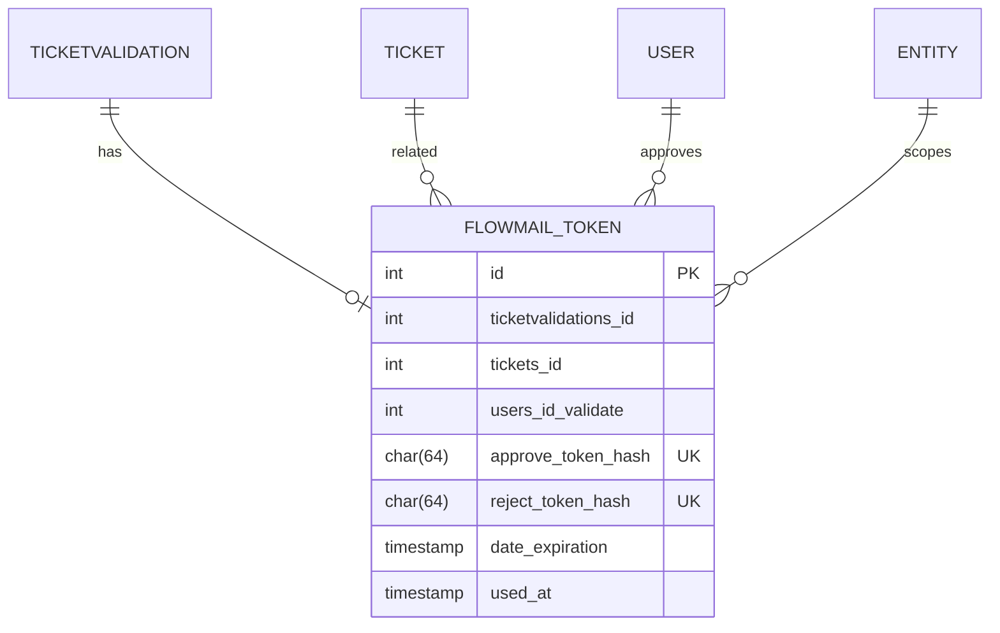

# Database - Tokens de Aprovacao

> **Audiencia:** Desenvolvedor
> **Relacionado:** [indice tecnico](../../README.md)

## O que e

Este documento descreve a tabela propria usada pelo FlowMail para controlar links publicos de aprovacao e recusa associados a validacoes nativas do GLPI.

## Estrutura

A tabela principal e `glpi_plugin_approvalbyemail_tokens`, retornada por `PluginApprovalbyemailRequest::tokenTable()`.

| Campo | Tipo no schema | Uso |
|-------|----------------|-----|
| `id` | `int unsigned AUTO_INCREMENT` | Identificador interno do token row. |
| `ticketvalidations_id` | `int unsigned` | ID logico da `TicketValidation` nativa associada. |
| `tickets_id` | `int unsigned` | Chamado relacionado a validacao. |
| `entities_id` | `int unsigned` | Entidade do chamado usada na sessao temporaria da decisao. |
| `users_id_validate` | `int unsigned` | Usuario aprovador normalizado para GLPI 10/11. |
| `approve_token_hash` | `char(64)` | Hash SHA-256 do token bruto de aprovacao. |
| `reject_token_hash` | `char(64)` | Hash SHA-256 do token bruto de recusa. |
| `date_creation` | `timestamp NULL` | Data de criacao do token row. |
| `date_expiration` | `timestamp NULL` | Prazo final do link; por padrao, 168 horas apos criacao. |
| `used_at` | `timestamp NULL` | Data em que aprovacao ou recusa foi consumida com sucesso. |

Indices confirmados no schema:

| Indice | Campos | Finalidade |
|--------|--------|------------|
| `PRIMARY KEY` | `id` | Identificacao do registro. |
| `ticketvalidations_id` | `ticketvalidations_id` | Busca por validacao e prevencao logica de duplicidade via `tokenExists()`. |
| `tickets_id` | `tickets_id` | Consulta por chamado relacionado. |
| `users_id_validate` | `users_id_validate` | Consulta por aprovador. |
| `approve_token_hash` | `approve_token_hash` | Busca unica do token de aprovacao. |
| `reject_token_hash` | `reject_token_hash` | Busca unica do token de recusa. |

Evidencias no codigo: `inc/request.class.php:293`, `inc/request.class.php:401`, `inc/request.class.php:413`, `inc/request.class.php:424`, `inc/request.class.php:428`, `inc/request.class.php:429`.

## Relacionamentos

Os relacionamentos abaixo sao logicos. O schema criado pelo plugin nao declara foreign keys no banco.

O ponto principal do diagrama e que o FlowMail nao substitui `TicketValidation`: ele apenas acrescenta uma linha de controle de token para cada validacao que precisa ser respondida por e-mail.

## O que cada estado ou valor significa

| Campo / valor | Significado | Quando e definido |
|---------------|-------------|-------------------|
| `used_at = NULL` | Nenhuma acao por token foi salva ainda. | Na criacao do token row. |
| `used_at` preenchido | A aprovacao ou recusa ja foi consumida. | Depois de `TicketValidation->update()` retornar sucesso. |
| `date_expiration` futuro | Link ainda dentro do prazo. | Na criacao, usando `time() + ttl_hours * 3600`. |
| `date_expiration` passado | Link expirado. | Calculado na leitura por `decideByToken()`. |
| Hash encontrado em `approve_token_hash` | A acao solicitada e aprovacao. | Busca feita por `findToken($token, 'approve')`. |
| Hash encontrado em `reject_token_hash` | A acao solicitada e recusa. | Busca feita por `findToken($token, 'reject')`. |

## Instalacao e remocao

Na instalacao, `hook.php` chama `PluginApprovalbyemailRequest::ensureSchema()` se a tabela ainda nao existe. Na remocao, o plugin tenta remover `glpi_plugin_approvalbyemail_tokens` e tambem a tabela legada `glpi_plugin_approvalbyemail_requests`, caso exista.

Evidencias: `hook.php:13`, `hook.php:16`, `hook.php:26`, `hook.php:32`.

## Riscos e pontos de atencao

- Como nao ha foreign keys reais, remover tickets, usuarios ou validacoes fora do fluxo esperado pode deixar tokens orfaos.
- `ensureSchema()` retorna imediatamente se a tabela ja existe; mudancas futuras de schema precisam de migration explicita.
- Nao ha limpeza automatica de tokens expirados no codigo inspecionado.
- `used_at` fica no registro inteiro; apos uma decisao salva, tanto o token de aprovacao quanto o de recusa daquele row passam a ser inutilizaveis.
- Os tokens brutos so aparecem nos links enviados por e-mail; logs, mensagens de erro ou novas docs nao devem expor esses valores.

---

 

  ━━━━━━━━━━━━━━━━━━━━━━━ 
  Curtiu o plugin? Deixe uma ⭐ no repositório para ajudar outros administradores a encontrá-lo. 
  Desenvolvido e mantido com apoio de <a href="https://www.forq.com.br/">Forq</a>

