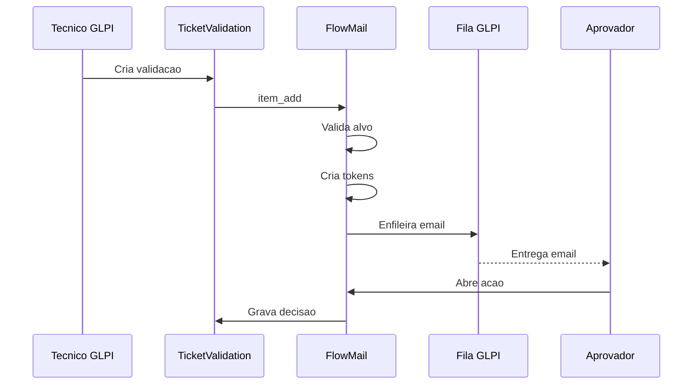

# Fluxo - Aprovacao por E-mail

> **Audiencia:** Desenvolvedor
> **Relacionado:** [indice tecnico](../../README.md)

## O que e

Este fluxo descreve como uma validacao nativa de chamado gera e-mail com botoes de aprovacao/recusa e como essa resposta volta para `TicketValidation`.

## Atores envolvidos

| Ator | Papel |
|------|-------|
| Tecnico ou gestor | Cria a solicitacao de aprovacao no chamado. |
| GLPI `TicketValidation` | Armazena a validacao nativa e dispara o hook de criacao. |
| FlowMail | Cria tokens, enfileira e-mail e processa a decisao publica. |
| `QueuedNotification` | Fila oficial de notificacoes usada para envio do e-mail. |
| Aprovador | Recebe o e-mail e escolhe aprovar ou recusar. |

## Visao geral

Observe que o FlowMail entra depois da criacao da validacao nativa. Ele nao cria um fluxo paralelo de aprovacao; ele adiciona a camada de e-mail e token ao registro `TicketValidation` existente.

## Passo a passo

1. `setup.php` registra o hook `item_add` para `TicketValidation`, apontando para `PluginApprovalbyemailRequest::onTicketValidationAdd()`.
2. Quando o GLPI adiciona uma validacao, `onTicketValidationAdd()` confirma que o item recebido e uma instancia de `TicketValidation`.
3. O plugin extrai `id`, `tickets_id` e o aprovador por `getValidationTargetUserId()`, suportando tanto `users_id_validate` quanto `itemtype_target`/`items_id_target`.
4. Se ja existe token para a validacao, o fluxo para para evitar duplicidade.
5. O ticket e o usuario aprovador sao carregados do banco.
6. O e-mail principal do aprovador e validado com `NotificationMailing::check()`.
7. `createTokens()` gera dois tokens brutos com `random_bytes(32)`, salva apenas seus hashes e define expiracao de 168 horas.
8. `queueApprovalEmail()` monta URLs publicas para aprovar/recusar e cria uma entrada em `QueuedNotification`.
9. O aprovador abre um dos links; `decision.php` chama `decideByToken()`.
10. Se a validacao ainda esta em `TicketValidation::WAITING`, o plugin grava `TicketValidation::ACCEPTED` ou `TicketValidation::REFUSED`.

Evidencias principais: `setup.php:28`, `inc/request.class.php:57`, `inc/request.class.php:71`, `inc/request.class.php:95`, `inc/request.class.php:490`, `inc/request.class.php:501`, `inc/request.class.php:543`.

## Estado e timing

| Momento | Estado relevante |
|---------|------------------|
| Criacao da validacao | `TicketValidation` deve existir e ter aprovador identificavel. |
| Criacao do token | `date_expiration` recebe agora + 168 horas. |
| Antes da decisao | `used_at` deve estar vazio e a validacao deve estar em `TicketValidation::WAITING`. |
| Depois da decisao | `TicketValidation` recebe status aceito/recusado e o token row recebe `used_at`. |

## Riscos e pontos de atencao

- Se o aprovador nao tiver e-mail principal valido, a validacao pode existir sem e-mail enfileirado pelo plugin.
- Se `QueuedNotification->add()` falhar, o codigo informa que a aprovacao foi criada, mas o e-mail nao entrou na fila.
- A aprovacao por link e uma mutacao via GET, entao qualquer abertura automatica do link pode aprovar a solicitacao.
- A recusa depende de comentario; falhas de validacao retornam para o formulario publico.
- O fluxo depende de `TicketValidation::WAITING`; se a validacao for respondida por outro caminho antes do link, o token deixa de conseguir gravar a decisao.
