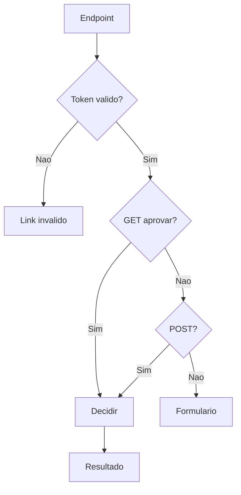

# Fluxo - Endpoints Publicos e Decisao por Token

> **Audiencia:** Desenvolvedor
> **Relacionado:** [indice tecnico](../../README.md)

## O que e

Este documento descreve os endpoints publicos do FlowMail e como `front/decision.php` valida token, metodo HTTP, comentario de recusa e resultado final.

## Atores envolvidos

| Ator | Papel |
|------|-------|
| Aprovador | Abre o link recebido por e-mail. |
| `approve.php` | Wrapper que define `decision=approve`. |
| `reject.php` | Wrapper que define `decision=reject`. |
| `decision.php` | Controller publico que valida e executa a decisao. |
| `PluginApprovalbyemailRequest` | Classe que localiza token, valida estado e atualiza `TicketValidation`. |

## Visao geral

O diagrama separa a validacao inicial do roteamento por metodo HTTP. Aprovacao por GET vai direto para a decisao; recusa por GET cai no formulario; POST executa a decisao com os dados enviados.

## Endpoints

| Arquivo | Papel | Autenticacao GLPI |
|---------|-------|-------------------|
| `front/approve.php` | Define `$_REQUEST['decision'] = 'approve'` e inclui `decision.php`. | Publico por token. |
| `front/reject.php` | Define `$_REQUEST['decision'] = 'reject'` e inclui `decision.php`. | Publico por token. |
| `front/decision.php` | Valida token/decisao, mostra formulario ou chama `decideByToken()`. | Publico por token. |

Em GLPI 11, `setup.php` registra `decision.php`, `approve.php` e `reject.php` como paths stateless quando `\Glpi\Http\SessionManager::registerPluginStatelessPath()` existe.

## Passo a passo

1. `approve.php` ou `reject.php` define a decisao e inclui `decision.php`.
2. `decision.php` le `token` e `decision` de `$_REQUEST`.
3. Se a decisao nao for `approve`/`reject` ou o token tiver menos de 40 caracteres, a pagina publica mostra `Link de aprovacao invalido.`.
4. Se o metodo for `GET` e a decisao for `approve`, o controller chama `decideByToken($token, 'approve', '')`.
5. Se o metodo for `POST`, o controller le `decision_comment` e chama `decideByToken($token, $decision, $comment)`.
6. Se a classe de dominio indicar `needs_comment`, o formulario e reexibido com a mensagem de erro.
7. Nos demais casos, `decision.php` exibe `Resposta salva` ou `Resposta nao salva`.
8. Para aprovacao bem-sucedida por GET, a pagina especial mostra `Chamado aprovado` e um link para abrir o chamado.

Evidencias: `front/approve.php:3`, `front/reject.php:3`, `front/decision.php:8`, `front/decision.php:11`, `front/decision.php:18`, `front/decision.php:32`, `front/decision.php:50`, `front/decision.php:153`.

## Validacoes de dominio

`PluginApprovalbyemailRequest::decideByToken()` executa as validacoes de negocio em ordem:

| Ordem | Validacao | Resultado quando falha |
|-------|-----------|------------------------|
| 1 | Token encontrado para a acao solicitada | `Link de aprovacao invalido.` |
| 2 | `used_at` vazio | `Link expirado, pois ja foi utilizado.` |
| 3 | `date_expiration` ainda valida | `Este link de aprovacao expirou.` |
| 4 | `TicketValidation` existe | `Solicitacao de aprovacao nao encontrada.` |
| 5 | Status ainda e `TicketValidation::WAITING` | `Solicitacao de aprovacao ja respondida.` |
| 6 | Recusa tem comentario | `Para recusar, informe uma justificativa.` |
| 7 | Comentario tem ate 500 caracteres | `A justificativa da recusa deve ter no maximo 500 caracteres.` |
| 8 | Aprovador existe | `Aprovador da solicitacao nao encontrado.` |
| 9 | `TicketValidation->update()` retorna sucesso | `Deu erro e nao foi possivel aprovar/recusar o chamado.` |

## Estado e timing

- Tokens expiram pelo campo `date_expiration`, gravado na criacao.
- Tokens usados sao bloqueados por `used_at`, preenchido somente depois de update bem-sucedido.
- A decisao so grava se a validacao nativa ainda estiver em espera.
- O formulario de recusa inclui `_glpi_csrf_token` quando `Session::getNewCSRFToken()` existe, embora a autorizacao de negocio venha do token do link.

## Riscos e pontos de atencao

- O endpoint de aprovacao por GET altera estado sem confirmacao adicional.
- O token nao e vinculado a IP, navegador ou sessao permanente; o segredo e o proprio link.
- O codigo diferencia link invalido, expirado e usado, o que ajuda suporte, mas tambem revela o estado geral do token para quem possui o link.
- O formulario publico usa HTML/CSS inline em PHP; mudancas visuais devem preservar escape com `PluginApprovalbyemailTool::h()`.
